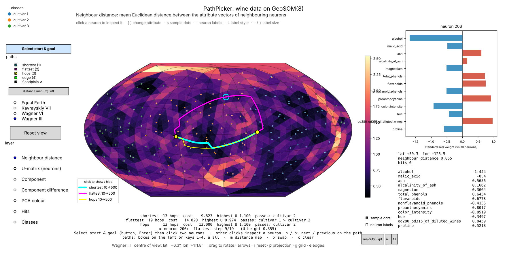

# DTGeoSOM — path finding on a spherical SOM with the distance transform

`mt.dtgeosom` finds **paths between two neurons of a trained [GeoSOM](https://github.com/takatsuka/GeoSOM)**
(a Self-Organising Map on a geodesic dome) with the method of

> M. Bui and M. Takatsuka, *Path finding on a spherical SOM using the distance transform and floodplain analysis*,
> Proceedings of the 6th International Workshop on Self-Organizing Maps (WSOM 2007), Bielefeld, Germany, 2007.

A SOM is a roadmap of a high-dimensional space. Given a start state and a goal state, the neurons on a path between
their best matching units are the **intermediate states** to pass through. The path is found as in robot motion
planning: a **distance wave** is spread from the goal over the lattice (the *distance transform*), with the U-height of
every neuron as the cost of entering it, and the path is read off by walking downhill from the start. A plain shortest
path may still cross a "mountain range" of the U-matrix (a cluster border with no data). **Floodplain analysis** then
keeps the path on the neurons below a U-height threshold and raises the threshold only as far as needed to join start
and goal: the *flattest, shortest* path.


*The paper's binary-tree experiment (examples/01_binary_tree.py): the shortest path 8 → 13 jumps across the bright
mountain range (8-9-12-13, not a path in the tree); the flattest path goes round it and passes 8-4-2-1-3-6-13, the tree
path — as in figures 8 and 9 of the paper. ✕ = neurons above the floodplain.*

**Contents** — [Features](#features) · [Installation](#installation) · [Quick start](#quick-start) ·
[Kinds of path](#kinds-of-path) · [Interactive path picker](#interactive-path-picker) ·
[Drawing paths in scripts](#drawing-paths-in-scripts) · [API overview](#api-overview) ·
[The algorithms](#the-algorithms) · [Examples](#examples) · [Development](#development) ·
[Releasing](#releasing) · [Authors](#authors) · [Licence and citation](#licence-and-citation)

## Features

- **The paper's method on GeoSOM**: the distance transform (Algorithm 2), reading a path off the distance map
  (Algorithm 1) and floodplain analysis for the flattest, shortest path (Algorithm 3) — plus `PathFinder.paper(som)`,
  which runs the algorithms exactly as printed, to reproduce the published results.
- **Four kinds of path** between the same two neurons: `shortest` (U-height cost), `flattest` (floodplain),
  `hops` (fewest steps on the geodesic grid) and `edge` (shortest walk through data space).
- **Start and goal as neurons or as samples** (a sample is mapped to its best matching unit).
- **The path as data**: its neurons, cost, number of hops, the weight vectors along it (the intermediate states),
  the classes it passes, the highest U-height it climbs, and the whole distance map.
- **An interactive path picker** on GeoSOM's rotatable map: a *Select start & goal* button, a check box per kind of
  path, the floodplain, distance maps, and inspecting the attributes of any neuron along a path.
- **Path drawing in scripts** (`plot_paths`, `PathViewer`): great-circle segments on any of GeoSOM's map projections,
  legend entries that show or hide a path, and PNG export.
- **Works with any mt.geosom map**: GeoSOM (sphere), PlaneSOM (plane or torus) and LineSOM.
- **The paper's synthetic data** (`datasets.binary_tree`) and three runnable examples.

## Installation

| Name | |
|---|---|
| `pip install …` | `dtgeosom` (from PyPI once released; until then `pip install -e .` in this folder) |
| Python import | `mt.dtgeosom` (`mt` is a namespace package shared with `mt.geosom`, `mt.geodesicdome`) |
| Requires | Python ≥ 3.10, [`geosom`](https://github.com/takatsuka/GeoSOM) ≥ 1.2, [`geodesicdomes`](https://github.com/takatsuka/GeodesicDome) ≥ 1.3, numpy |
| Optional | `pip install "dtgeosom[interactive]"` for the map windows (matplotlib); `[dev]` adds pytest, ruff and the build tools |

For development, `./setup_env.sh` builds a ready-to-use environment in `.venv` (see [Development](#development)).

## Quick start

```python
from mt.geosom import datasets
from mt.geosom.GeoSOM import GeoSOM
from mt.dtgeosom import PathFinder

ds = datasets.load('wine')
x = datasets.standardise(ds.data)
som = GeoSOM(8).train(x, epochs=30)

finder = PathFinder(som)
p = finder.shortest_path(x[136], x[9])      # samples (mapped to their BMUs) or neuron indices
q = finder.flattest_path(x[136], x[9])      # stays on the floodplain of the U-matrix

q.nodes                 # neuron indices, start ... goal
q.hops, q.cost          # number of steps, cost on the distance map
q.states(som)           # weight vectors along the path: the intermediate states
q.threshold             # U-height of the floodplain that holds the path
q.distance              # the distance map (cost from every neuron to the goal; inf = unreachable)
q.visited_labels(som.node_labels(x, ds.labels))   # classes passed on the way

paths = finder.all_paths(x[136], x[9])      # {'shortest', 'flattest', 'hops', 'edge'}: see "Kinds of path"

from mt.dtgeosom.gui import PathPicker, plot_paths     # needs matplotlib
plot_paths(som, list(paths.values()), x, ds.labels, names=list(paths),
           floodplain=q.threshold, projection='Wagner III').show()
PathPicker(finder, x, ds.labels).show()                # pick the start and goal with the mouse
```

## Kinds of path

| Kind | `finder.path(a, b, kind)` | What it minimises | Colour in the picker |
|---|---|---|---|
| `'shortest'` | `shortest_path` | the distance transform with the U-height of every neuron entered as its cost (the paper's shortest path) | cyan |
| `'flattest'` | `flattest_path` | the same, on the floodplain: never above the lowest U-height at which start and goal connect (Algorithm 3) | magenta |
| `'hops'` | `hop_path` | the number of steps on the geodesic grid, ignoring the data (ties: the straightest route) | yellow |
| `'edge'` | `edge_path` | the sum of distances between neighbouring weight vectors: the shortest walk through data space | lime |

`finder.all_paths(a, b)` returns all four as a dict. Comparing them shows what the U-matrix and the floodplain add:
where all four agree the map is flat; where `flattest` departs from the others it is going round a ridge with no data.


*examples/02_paths_between_samples.py on the UCI wine data: the shortest (U-height), fewest-hops and data-space
(`edge`) paths cut straight across a border with no data; the flattest path goes round it, through the cultivar-2
region.*

## Interactive path picker

`PathPicker` (`examples/03_interactive_paths.py`) is GeoSOM's rotatable map viewer with path finding added.



```bash
python examples/03_interactive_paths.py                          # wine data
python examples/03_interactive_paths.py --paths all              # all four kinds from the start
python examples/03_interactive_paths.py --data tree              # the paper's binary tree on a GeoSOM(2)
python examples/03_interactive_paths.py --data penguins --paths shortest,flattest
```

| Do | How |
|---|---|
| Choose the start and goal | press **Select start & goal** (top left) or `Enter`, then click the start neuron and the goal neuron; the paths are drawn when the goal is clicked. The button (or `Esc`) cancels, keeping the current paths. With no path yet — when the window opens, or after `c` — the picker is already selecting, so just click two neurons. |
| Inspect a neuron | any other click: its attribute vector appears on the right (bar chart and values), and the line under the map says which step of which path it is, or that it is not on a path |
| Walk along the path | `n` / `b`: inspect the next / previous neuron on the path |
| Show or hide a kind of path | the **paths** check boxes on the left (each in its path's colour), keys `1`–`4`, or click its legend entry; `a` shows all four |
| Show or hide the floodplain | the **floodplain ✕** check box: crosses on the neurons above the flattest path's threshold |
| Colour the map by a distance map | the **distance map** button or `m`: each press shows the next shown path's distance map to the goal, then the U-matrix again |
| Swap start and goal / clear | `x` / `c` |
| Rotate, change projection, layers, labels | as in GeoSOM's `SOMViewer`: drag, arrow keys, the projection and layer lists, `s` sample dots, `l` labels, … |

The panel under the map lists each path's number of hops, its cost, the highest U-height it climbs and the classes of the
samples it passes. Example options: `--data` (iris, penguins, wine, clusters, a CSV file, or `tree`), `--paths`
(comma-separated kinds, or `all`), `--step` (the step cost of `shortest` and `flattest`: `node`, `mean`, `edge`,
`hops`), `--projection`, `--frequency`, `--epochs`, `--start` / `--goal` (pre-select a path), and `--save FILE` (write
an image instead of opening a window).

In your own code:

```python
from mt.dtgeosom.gui import PathPicker

picker = PathPicker(PathFinder(som), x, labels, kinds=('shortest', 'flattest'), projection='Wagner III')
picker.set_endpoints(10, 500)        # or let the user click
picker.result                        # {kind: SOMPath} of the paths shown
picker.show()
```

## Drawing paths in scripts

```python
from mt.dtgeosom.gui import PathViewer, plot_paths

viewer = plot_paths(som, [p, q], x, labels, names=['shortest', 'flattest'], floodplain=q.threshold,
                    projection='Wagner III', path='paths.png')      # centred on the paths; saved when path= is given
viewer.set_path_visible('shortest', False)    # or click its legend entry; toggle_path(...), path_visible(...)
viewer.centre_on(q)                           # rotate the sphere so the path is in the middle
viewer.show()
```

`PathViewer(som, data, labels, **SOMViewer_options)` is GeoSOM's `SOMViewer` with paths: `add_path(path, color, label)`,
`clear_paths()`, `show_floodplain(threshold)`, `centre_on(...)`, `set_path_visible(...)`. Every step between neighbouring
neurons is drawn along the great circle joining them and broken where it crosses the edge of the map, so paths stay
right while the sphere is rotated or the projection changed.

## API overview

**`PathFinder(som, step='node', diagonal_factor=1.0, method='wavefront', rule='exact')`** — everything for one
trained map (GeoSOM, PlaneSOM or LineSOM).

| | |
|---|---|
| `shortest_path(a, b)`, `flattest_path(a, b, threshold='iterative')`, `hop_path(a, b)`, `edge_path(a, b)` | one path; `a`, `b` are neuron indices or samples |
| `path(a, b, kind)`, `all_paths(a, b, kinds=KINDS)`, `paths(pairs, kind)` | by kind; all kinds; many pairs |
| `distance_map(goal, allowed=None)` | the distance transform towards `goal` (a `Transform`; `.distance` is the map) |
| `floodplain(threshold)`, `u_height`, `neuron(x)` | neurons below a U-height; the U-heights; a sample's BMU |
| `PathFinder.paper(som)` | the paper's settings: Algorithm 2 verbatim, √2 diagonals, steepest descent |
| `refresh()` | re-read the map after training it further |
| `step` | cost of one step: `'node'` (U-height of the neuron entered, the paper), `'mean'`, `'edge'`, `'hops'` or a callable `f(c, n)` |
| `method` | `'wavefront'` (the paper's FIFO distance wave), `'dijkstra'` (same result) or `'paper'` (printed version) |
| `rule` | reading the path off the map: `'exact'` (follow the wave back) or `'steepest'` (Algorithm 1 as printed) |

**`SOMPath`** — `nodes`, `start`, `goal`, `kind`, `cost`, `hops`, `distance` (the distance map), `transform`,
`threshold` and `thresholds` (flattest paths: the final and every tried U-height threshold), `states(som)`,
`max_height(u_height)`, `visited_labels(node_labels)`.

**Lower level** — `Lattice.from_som(som)` (neighbours, U-heights, positions, diagonal flags of the 2D index array);
`distance_transform(lattice, goal, step=…, allowed=…, method=…)`; `descend(lattice, transform, start, rule=…)`;
`lattice_flattest_path` / `lattice_shortest_path`; `minimax_threshold(lattice, a, b)`; `path_cost(lattice, nodes, step)`;
`NoPathError`. **Data** — `datasets.binary_tree(depth)`, `tree_path(a, b)`, `path_agrees_with_tree(...)`.

| Module | What |
|---|---|
| `lattice` | `Lattice`: the SOM's neighbour graph, U-heights, neuron positions and diagonal flags |
| `transform` | `distance_transform`: the distance wave (`'wavefront'`, `'dijkstra'`, `'paper'`), step costs, `allowed` mask |
| `paths` | `descend` (Algorithm 1), `SOMPath`, `path_cost`, `NoPathError` |
| `floodplain` | `flattest_path` (Algorithm 3), `shortest_path`, `minimax_threshold`, `floodplain` |
| `pathfinder` | `PathFinder`, `KINDS` |
| `datasets` | the synthetic data of section 4.1 |
| `gui` | `PathViewer`, `plot_paths`, `PathPicker`, `great_circle` (needs matplotlib) |

## The algorithms

| Paper | Here |
|---|---|
| Algorithm 2 — distance transform on the Geodesic SOM | `distance_transform(lattice, goal, method='wavefront')` (FIFO distance wave, re-queues every improved neuron) |
| Algorithm 1 — shortest path by steepest descent | `descend(lattice, transform, start, rule='steepest' \| 'exact')` |
| Algorithm 3 — flattest, shortest path (floodplain) | `flattest_path(..., threshold='iterative')`; `'minimax'` finds the final threshold directly |
| U-height ("avg diff") of the neuron entered as the step cost | `step='node'` (default); also `'mean'`, `'edge'`, `'hops'`, or any `f(c, n)` |
| √2 for diagonal neighbours of the 2D index array | `diagonal_factor=np.sqrt(2)`; the diagonal flags are recovered from GeoSOM's dome (`Lattice.diagonal`) |
| Copy updates to duplicate seam neurons | not needed: GeoSOM's neurons are unique |
| Everything exactly as printed | `PathFinder.paper(som)` (`method='paper'`, steepest descent) |

Details, and where the implementation departs from the printed pseudocode and why:
[docs/algorithm.md](docs/algorithm.md).

## Examples

| Script | What |
|---|---|
| `examples/01_binary_tree.py` | The paper's section 4.1: a 15-node binary tree on a GeoSOM(2); shortest vs flattest paths for every pair of tree nodes, and the 8 → 13 path of figures 8 and 9. Options: `--show`, `--paper`, `--pair A B`, `--seed`, `--frequency`, `--epochs`, `--save` |
| `examples/02_paths_between_samples.py` | All four kinds of path between two samples of iris / penguins / wine / clusters (by default the two of different classes furthest apart), with the attributes that change most along the way. Options: `--data`, `--start`, `--goal`, `--show`, `--frequency`, `--epochs`, `--save` |
| `examples/03_interactive_paths.py` | The interactive path picker (above) |

On the binary tree (GeoSOM(2), 42 neurons, the paper's training settings, seed 0) 46 % of the shortest paths between
two tree nodes follow the tree, and 82 % of the flattest paths. The NSW library benchmarking data of the paper's
section 4.2 are not included.

## Development

```bash
./setup_env.sh          # creates .venv here with everything installed, and opens a shell in it
pytest
ruff check .
```

`setup_env.sh` installs DTGeoSOM (editable), geosom, geodesicdomes, matplotlib, pytest, ruff and the build tools into
`.venv` in this folder, plus PyTorch for the GPU if this machine has one, checks that a path can be found, and adds a
hook to `~/.zshrc` that activates the environment in new terminals inside the project. It installs GeoSOM and
GeodesicDome in editable mode from `../GeoSOM` and `../GeodesicDome` when those checkouts exist (or `--som PATH`,
`--dome PATH`), and from PyPI otherwise. `./setup_env.sh --help` lists the options (`--check`, `--recreate`,
`--gpu none`, `--python PATH`, `--venv PATH`, `--no-shell-hook`, …). Without the script: `pip install -e ".[dev]"`.

GitHub Actions (`.github/workflows/tests.yml`) run the lint, the tests (Linux, macOS and Windows; Python 3.10–3.14)
and the three examples on every push and pull request.

## Releasing

Publishing a GitHub release with a tag `vX.Y.Z` uploads that version to PyPI automatically
(`.github/workflows/publish.yml`): the workflow checks the tag against `__version__` and `CITATION.cff`, builds and
tests the package, uploads it with PyPI trusted publishing, and attaches the files to the release. Pushing to `main`
never publishes. The one-time set-up and the steps are in [RELEASING.md](RELEASING.md).

## Authors

- **Masahiro Takatsuka** (masa@takatsuka.org) — author and maintainer
- **Michael Bui** — co-author (and co-author of the WSOM 2007 paper this package implements)

## Licence and citation

AGPL-3.0-or-later with an attribution term; see [LICENSE](LICENSE) and [NOTICE](NOTICE). Please cite the WSOM 2007
paper above and the software ([CITATION.cff](CITATION.cff)).
