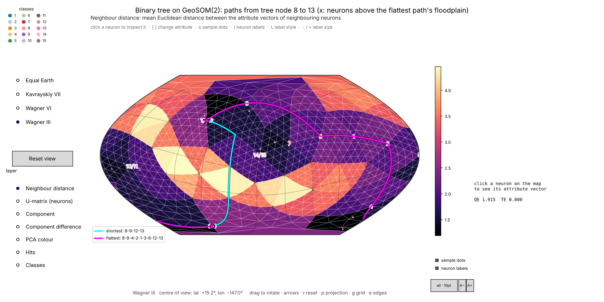
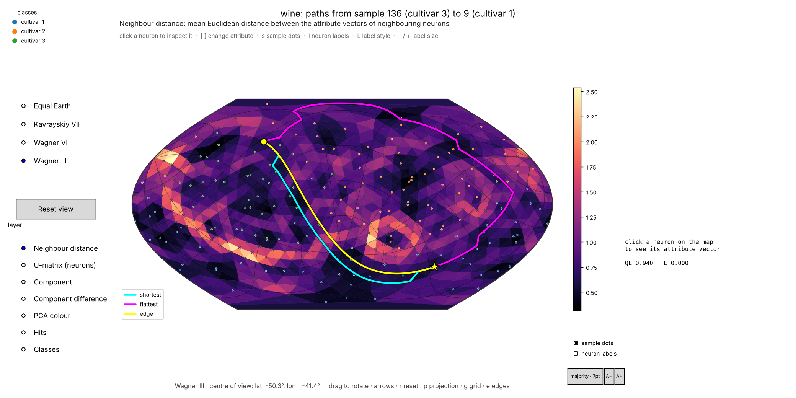

# DTGeoSOM — path finding on a spherical SOM with the distance transform

`mt.dtgeosom` finds **paths between two neurons of a trained [GeoSOM](https://github.com/takatsuka/GeoSOM)**
(a Self-Organising Map on a geodesic dome) with the method of

> M. Bui and M. Takatsuka, *Path finding on a spherical SOM using the distance transform and floodplain analysis*,
> Proceedings of the 6th International Workshop on Self-Organizing Maps (WSOM 2007), Bielefeld, Germany, 2007.

A SOM is a roadmap of a high-dimensional space. Given a start state and a goal state, the neurons on a path between
their best matching units are the **intermediate states** to pass through. The path is found as in robot motion
planning: a **distance wave** is spread from the goal over the lattice (the *distance transform*), with the U-height of
every neuron as the cost of entering it, and the path is read off by walking downhill from the start. A plain shortest
path may still cross a "mountain range" of the U-matrix (a cluster border with no data). **Floodplain analysis** then
keeps the path on the neurons below a U-height threshold and raises the threshold only as far as needed to join start
and goal: the *flattest, shortest* path.



*The paper's binary-tree experiment (examples/01_binary_tree.py): the shortest path 8 → 13 jumps across the bright
mountain range (8-9-12-13, not a path in the tree); the flattest path goes round it and passes 8-4-2-1-3-6-13, the tree
path — as in figures 8 and 9 of the paper. ✕ = neurons above the floodplain.*

| Name | |
|---|---|
| `pip install …` | `dtgeosom` (not yet on PyPI: `pip install -e .`) |
| Python import | `mt.dtgeosom` (`mt` is a namespace package shared with `mt.geosom`, `mt.geodesicdome`) |
| Builds on | [`geosom`](https://github.com/takatsuka/GeoSOM) ≥ 1.2, [`geodesicdomes`](https://github.com/takatsuka/GeodesicDome) |

## Quick start

```python
from mt.geosom import datasets
from mt.geosom.GeoSOM import GeoSOM
from mt.dtgeosom import PathFinder

ds = datasets.load('wine')
x = datasets.standardise(ds.data)
som = GeoSOM(8).train(x, epochs=30)

finder = PathFinder(som)
p = finder.shortest_path(x[136], x[9])      # samples (mapped to their BMUs) or neuron indices
q = finder.flattest_path(x[136], x[9])      # stays on the floodplain of the U-matrix

q.nodes                 # neuron indices, start ... goal
q.states(som)           # weight vectors along the path: the intermediate states
q.threshold             # U-height of the floodplain that holds the path
q.distance              # the distance map (cost from every neuron to the goal; inf = unreachable)
q.visited_labels(som.node_labels(x, ds.labels))   # classes passed on the way

from mt.dtgeosom.gui import plot_paths      # needs matplotlib: pip install "geosom[interactive]"
plot_paths(som, [p, q], x, ds.labels, names=['shortest', 'flattest'],
           floodplain=q.threshold, projection='Wagner III').show()
```

## The algorithms

| Paper | Here |
|---|---|
| Algorithm 2 — distance transform on the Geodesic SOM | `distance_transform(lattice, goal, method='wavefront')` (FIFO distance wave, re-queues every improved neuron) |
| Algorithm 1 — shortest path by steepest descent | `descend(lattice, transform, start, rule='steepest' \| 'exact')` |
| Algorithm 3 — flattest, shortest path (floodplain) | `flattest_path(..., threshold='iterative')`; `'minimax'` finds the final threshold directly |
| U-height ("avg diff") of the neuron entered as the step cost | `step='node'` (default); also `'mean'`, `'edge'` (distance between weight vectors), or any `f(c, n)` |
| √2 for diagonal neighbours of the 2D index array | `diagonal_factor=np.sqrt(2)`; the diagonal flags are recovered from GeoSOM's dome (`Lattice.diagonal`) |
| Copy updates to duplicate seam neurons | not needed: GeoSOM's neurons are unique |
| Everything exactly as printed | `PathFinder.paper(som)` (`method='paper'`, steepest descent) |

Details, and where the implementation departs from the printed pseudocode and why:
[docs/algorithm.md](docs/algorithm.md).

## What is here

| Module | What |
|---|---|
| `lattice` | `Lattice`: the SOM's neighbour graph, U-heights and diagonal flags (`Lattice.from_som(som)`) |
| `transform` | `distance_transform`: the distance wave (`'wavefront'`, `'dijkstra'`, `'paper'`), step costs, `allowed` mask |
| `paths` | `descend` (Algorithm 1), `SOMPath`, `path_cost`, `NoPathError` |
| `floodplain` | `flattest_path` (Algorithm 3), `shortest_path`, `minimax_threshold`, `floodplain` |
| `pathfinder` | `PathFinder`: everything for a trained GeoSOM (also PlaneSOM / LineSOM) |
| `datasets` | `binary_tree`, `tree_path`, `path_agrees_with_tree` — the synthetic data of section 4.1 |
| `gui` | `PathViewer` (GeoSOM's rotatable `SOMViewer` with paths and the floodplain), `plot_paths` |

## Examples

```bash
python examples/01_binary_tree.py            # section 4.1: success rate of shortest vs flattest paths, figure 8/9
python examples/01_binary_tree.py --show     # rotatable map
python examples/02_paths_between_samples.py --data wine --show
```

On the binary tree (GeoSOM(2), 42 neurons, the paper's training settings, seed 0) 46 % of the shortest paths between
two tree nodes follow the tree, and 82 % of the flattest paths.



*examples/02_paths_between_samples.py on the UCI wine data: the shortest paths (U-height and weight-vector-distance
costs) cut straight across a border with no data; the flattest path goes through the cultivar-2 region.*

## Development

```bash
./setup_env.sh          # creates .venv here with everything installed, and opens a shell in it
pytest
ruff check .
```

`./setup_env.sh --help` lists the options (`--check`, `--recreate`, `--gpu none`, `--python PATH`, …). It installs
GeoSOM and GeodesicDome in editable mode from `../GeoSOM` and `../GeodesicDome` when those checkouts exist, and from
PyPI otherwise. Without the script: `pip install -e ".[dev]"`.

GitHub Actions run the lint, the tests (Linux, macOS, Windows; Python 3.10–3.14) and the examples on every push and
pull request. Releases are automatic: pushing a commit to `main` with a new version number publishes it to PyPI and
creates the GitHub release — see [RELEASING.md](RELEASING.md).

## Licence and citation

AGPL-3.0-or-later with an attribution term; see [LICENSE](LICENSE) and [NOTICE](NOTICE). Please cite the WSOM 2007
paper above and the software ([CITATION.cff](CITATION.cff)).
